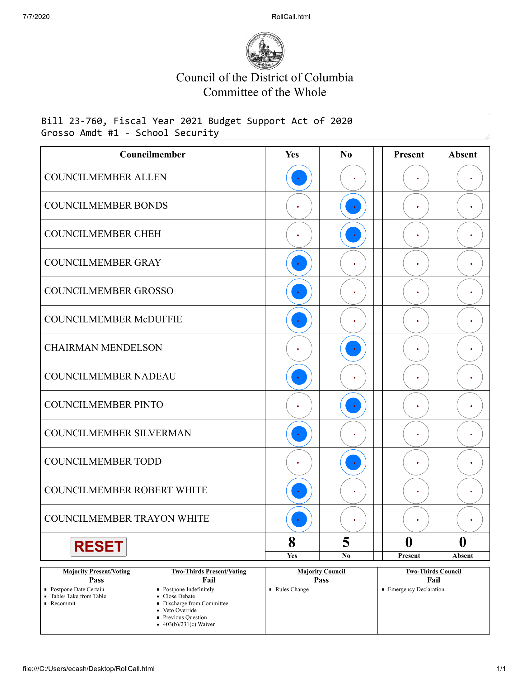

# dc-council-votes
The Council of the District of Columbia hosts a Legislative Information Management System (LIMS) which provides access to information about the legislative activities of the council via API. However the API has a few deficiencies: 
1. The API structure makes it challenging to output a flat file of vote records. This script parses the API to create a flat csv file that contains most information for each vote including the vote records of individual council members. 
2. Some votes are recorded in PDF files, and are not recorded in the API. This script automatically downloads those PDF files and uses OCR and image analysis to parse the PDF files and decode available vote records.

## Usage

### Example
```
python3 dc_council.py <token> 23 1
```

### Output
Example Output [](outputListOfVotes_1_23.csv)

### Details
```
python3 dc_council.py <token> <councilPeriodId> <legislationType>
```

  - **token**   A LIMS developer access token is required. Get the token [here](https://lims.dccouncil.us/developerRegistration)
  -  **councilPeriodId**  Council Period ID, https://lims.dccouncil.us/api/help/index.html#!/PublicData/GetCouncilPeriods, default=24 (2021-2022)
*Periods 20-24 have been tested*  

  - **legislationType**  Legislation Type, see https://lims.dccouncil.us/api/help/index.html#!/PublicData/GetLegislationCategories, default=1 (Bill)
  *Type 1 (Bill) has been tested*


## Design
Since LIMS imposes rate limiting and PDF processing is slow, we use a basic CSV file to keep track of progress when processing data about each individual bill. In the event of an issue during a script run, the script can be restarted and will pick up where it left off. 

Data about each bill is stored locally in a pickle file in the data/*legislationType*_*councilPeriodID*/ directory.

After data analysis is complete for each bill, the data about each bill is re-loaded and output as a single csv file.

### PDF Processing
PDF processing was designed specifically around amendment votes int he Committee of the Whole in council period 23 (e.g. B23-0760) where vote tallies were recorded in PDF format only. Multiple votes can be tallied per PDF, so we scan every page for potential votes. 
1. Convert the PDF into a series of images
2. Analyze each page using the Tesseract Optical Character Recognition (OCR) library for a string that is present on pages that record votes.
3. Use OCR to read council member names and identify the location of dots that will indicate different vote outcomes (Yes, No, Present, Absent)
4. Read the color of the pixels at those target locations, determine if the location is blank or has a blue dot indicating the vote outcome

*See pixels analyzed for vote outcomes in an example image below*




## LIMS Information
- https://lims.dccouncil.us/ 
- https://lims.dccouncil.us/api/help/index.html (API Info)
- https://lims.dccouncil.us/developerRegistration (Developer Authorization)
